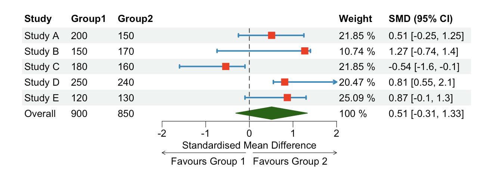

## Overview

`Forest plots` are a visual representation that summarises findings from various scientific studies that investigate a common research question. They find significant application in the field of `meta-analysis`, a type of statistical analysis that combines and examines results from a number of independent studies. 
More practically, forest plots identify a statistic that is common to such set of studies and report the various instances of that statistic. This, in turn, allows to compare the different results and the significance of the overall pooled summary effect. <br/>
<br/>

Among the **benefits** of forest plots, we find:

* clear and concise `visual representation` of results;
* `effect size` and `confidence interval` comparison across different studies;
* overall, useful tool to evaluate the consistency and strength of evidence, identify potential sources of bias, 
  and make informed judgments about the effect of interventions or exposures.


## Forest Plots in R

One of the most popular R packages used for forest plots is [forestploter](https://cran.r-project.org/web/packages/forestploter/vignettes/forestploter-intro.html). Compared to other packages (e.g., forestplot), `forestploter` focuses entirely on forest plots, which are treated as a table. Moreover, it allows to control for graphical parameters with a theme and to have confidence intervals spread across multiple columns and divided by groups.

<br/>

### Generate Dataset

The code snippet below shows how to `generate` a `dataset` and create a `basic layout` for a forest plot:

{}
```R
# Load necessary packages
library(forestploter)
library(dplyr)

# Create dataset
data <- data.frame(
  Study = c("Study A", "Study B", "Study C", "Study D", "Study E"),
  Group1 = c(200, 150, 180, 250, 120),
  Group2 = c(150, 170, 160, 240, 130),
  smd = c(0.51, 1.27, -0.54, 0.81, 0.87),
  CI_Lower = c(-0.25, -0.74, -1.6, 0.55, -0.1),
  CI_Upper = c(1.25, 1.4, -0.1, 2.1, 1.3)
)

# Prepare forest plot layout
data$se <- (data$CI_Upper - data$CI_Lower) / (2 * 1.96)
data$Weight <- 1/data$se^2
data$Weight <- data$Weight/sum(data$Weight)

pooled_effect <- round(sum(data$smd * data$Weight),2)

data$n <- (data$Group1 + data$Group2)
n_studies <- 5 
pooled_se <- sqrt(
  (sum((data$n - 1) * data$se^2)) / ((sum(data$n) - n_studies))
)

z_score <- qnorm(0.975)
lower_bound <- round(pooled_effect - z_score * pooled_se, 2)
upper_bound <- round(pooled_effect + z_score * pooled_se, 2)

data$Weight <- round(100*(data$Weight), 2)

data$` ` <- paste(rep(" ", 30), collapse = " ")
data$`SMD (95% CI)` <- paste(data$smd, " [", data$CI_Lower, ", ", data$CI_Upper, "]", sep = "")

data <- data %>%
  select(Study, Group1, Group2, smd, CI_Lower, CI_Upper, se, ` `, Weight, `SMD (95% CI)`)

totals <- c(" ", sum(data$Group1), sum(data$Group2), pooled_effect, lower_bound,
            upper_bound, pooled_se, " ", sum(data$Weight), 
            paste(pooled_effect, " [", lower_bound, ", ", upper_bound, "]", sep = ""))

data <- rbind(data, totals)

data$Weight <- paste(data$Weight, "%")

data[nrow(data), 1] <- "Overall"
```
{}

### Create Forest Plot Theme
The following code snippet shows how to **set** a **personalised theme** for a forest plot:

{}
```R
tm <- forest_theme(base_size = 10,
                   # Graphical parameters of confidence intervals
                   ci_pch = 15,
                   ci_col = "#0e8abb",
                   ci_fill = "red",
                   ci_alpha = 1,
                   ci_lty = 1,
                   ci_lwd = 2,
                   ci_Theight = 0.2,
                   # Graphical parameters of reference line
                   refline_lwd = 1,
                   refline_lty = "dashed",
                   refline_col = "grey20",
                   # Graphical parameters of vertical line
                   vertline_lwd = 1,
                   vertline_lty = "dashed",
                   vertline_col = "grey20",
                   # Graphical parameters of diamond shaped summary CI
                   summary_fill = "#006400",
                   summary_col = "#006400")

```
{}

{}
Type `help(forest_theme)` in your R terminal for more info about the `forest_theme()` function arguments.
{}

### Draw Forest Plot
The following code snippet shows how to **generate** a **forest plot** once dataset and theme are set:

{}
```R
# Final data manipulation part 
data$CI_Upper <- as.numeric(data$CI_Upper)
data$CI_Lower <- as.numeric(data$CI_Lower)
data$smd <- as.numeric(data$smd)
data$se <- as.numeric(data$se)

# Forest plot
pt <- forest(data[,c(1:3, 8:10)],
             est = data$smd,
             lower = data$CI_Lower, 
             upper = data$CI_Upper,
             sizes = 0.8,
             is_summary = c(rep(FALSE, nrow(data)-1), TRUE),
             ci_column = 4,
             ref_line = 0,
             arrow_lab = c("Favours Group 1", "Favours Group 2"),
             xlim = c(-2, 2),
             ticks_at = c(-2, -1, 0, 1, 2),
             xlab = "Standardised Mean Difference",
             theme = tm)

plot(pt)


```
{}


{}
Type `help(forest)` in your R terminal for more info about the `forest()` function arguments.
{}

This is what the `final output` should look like:

<!--  -->

<div style="text-align: center;">
    
</div>


## Interpret Forest Plots
The following is an explanation of how to interpret the figure above:

* **Study**: results source.
* **Group 1/2**: number of participants in the study. Normally the two groups are split between `treatment` and `control` groups.
* **Squares**  (red): effect size of the indvidual studies. In this example, the effect size is represented by the `standardised mean difference` between the averages of the two groups. Other possible effect sizes are `mean difference`, `odds ratio`, or `hazard ratio`.
* **Horizontal** (blue) **lines**: `95% confidence intervals` (CI). The interpretation is that we are 95% confident that the true value of the effect size lies between the lower and upper bounds. The wider the CI the less precise the study.
* **Diamond** (green): `pooled summary effect` of all the studies included in the meta-analysis. The middle points of the diamond represent the pooled effect, while the points on the sides its 95% confidence interval.
* **Dotted Line**: this line is known as `line of no effect` and it is plotted at the exact point where, relative to the effect size chosen in the analyis, there is no difference between the estimates of the two groups. If the effect size is based on a difference, the line of no effect will be at 0, whereas if the effect size is based on a ratio, the line of no effect will be at 1. This line is very useful to `interpret the results`, in fact, if the CI intersects the line, the results are **NOT significant**. In this case the pooled summary effect is not significant.
* **Weight**: study weight is proportional to study precision and it represents the influence of each individual study on the pooled effect size. More practically, when the standard error of the estimate of a study increases, its weight decreases. An alternative approach is to use a weight that is positively correlated with sample size.
* **SMD (95% CI)**: summary of effect size and confidence intervals in the graphical representation.
