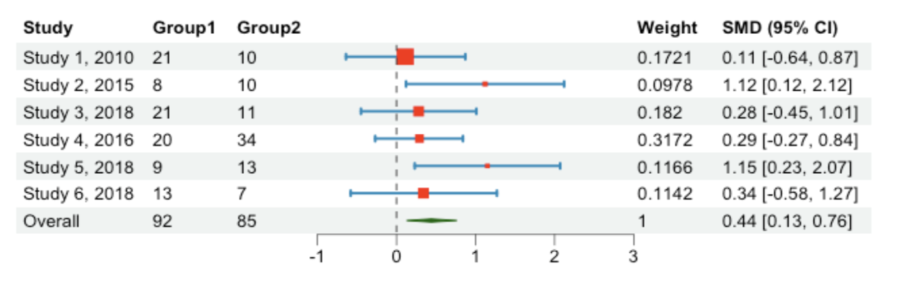

## Overview

`Forest plots` are a visual representation that summarises findings from various scientific studies that investigate a common research question. They find significant application in the field of `meta-analysis`, a type of statistical analysis that combines and examines results from a number of independent studies. 
More practically, forest plots identify a statistic that is common to such set of studies and report the various instances of that statistic. This, in turn, allows to compare the different results and the significance of the overall pooled summary effect. <br/>
<br/>

Among the **benefits** of forest plots, we find:

* clear and concise `visual representation` of results;
* `effect size` and `confidence interval` comparison across different studies;
* overall, useful tool to evaluate the consistency and strength of evidence, identify potential sources of bias, 
  and make informed judgments about the effect of interventions or exposures.


## Forest Plots in R

One of the most popular R packages used for forest plots is [forestploter](https://cran.r-project.org/web/packages/forestploter/vignettes/forestploter-intro.html). Compared to other packages (e.g., forestplot), `forestploter` focuses entirely on forest plots, which are treated as a table. Moreover, it allows to control for graphical parameters with a theme and to have confidence intervals spread across multiple columns and divided by groups.

<br/>

### Upload/Generate Dataset
The code snippet below shows how to `upload` an **example dataset** and generate a **basic layout** for the forest plot:

{}
```R
# Load necessary packages
library(forestploter)
library(grid)

# Retrieve example dataset from the `forestploter` package
data <- read.csv(system.file("extdata", "example_data.csv", package = "forestploter"))

# Data manipulation
data <- data[,1:6]

data$Subgroup <- ifelse(is.na(data$Placebo), 
                      data$Subgroup,
                      paste0("   ", data$Subgroup))

data$Treatment <- ifelse(is.na(data$Treatment), "", data$Treatment)
data$Placebo <- ifelse(is.na(data$Placebo), "", data$Placebo)
data$se <- (log(data$hi) - log(data$est))/1.96

data$` ` <- paste(rep(" ", 20), collapse = " ")

data$`HR (95% CI)` <- ifelse(is.na(data$se), "",
                             sprintf("%.2f (%.2f to %.2f)",
                                     data$est, data$low, data$hi))

```
{}

A valid alternative is to `generate` a simulated dataset of our own:

{}
```R
# Load necessary packages
library(forestploter)
library(dplyr)


# Generate dataset
data <- data.frame(
  Study = c("Study 1, 2010", "Study 2, 2015", "Study 3, 2018", "Study 4, 2016", "Study 5, 2018", "Study 6, 2018"),
  Group1 = c(21, 8, 21, 20, 9, 13),
  Group2 = c(10, 10, 11, 34, 13, 7),
  smd = c(0.11, 1.12, 0.28, 0.29, 1.15, 0.34),
  CI_Lower = c(-0.64, 0.12, -0.45, -0.27, 0.23, -0.58),
  CI_Upper = c(0.87, 2.12, 1.01, 0.84, 2.07, 1.27),
  Weight = c(0.1721, 0.0978, 0.1820, 0.3172, 0.1166, 0.1142)
)

# Preparing layout for forest plot
data$se <- (log(data$CI_Upper)-log(data$smd))/1.96
data$` ` <- paste(rep(" ", 30), collapse = " ")
data$`SMD (95% CI)` <- c("0.11 [-0.64, 0.87]", "1.12 [0.12, 2.12]", "0.28 [-0.45, 1.01]", "0.29 [-0.27, 0.84]", "1.15 [0.23, 2.07]", "0.34 [-0.58, 1.27]")

data <- data %>%
  select(Study, Group1, Group2, smd, CI_Lower, CI_Upper, se, ` `, Weight, `SMD (95% CI)`)

totals <- c(" ", 92, 85, 0.44, 0.13, 0.76, 0.12, " ", 1, "0.44 [0.13, 0.76]")
data <- rbind(data, totals)
data[nrow(data), 1] <- "Overall"
```
{}

### Create Forest Plot Theme
The following code snippet shows how to **set** a **personalised theme** for the forest plot:

{}
```R
tm <- forest_theme(base_size = 10,
                   # Graphical parameters of confidence intervals
                   ci_pch = 15,
                   ci_col = "#0e8abb",
                   ci_fill = "red",
                   ci_alpha = 1,
                   ci_lty = 1,
                   ci_lwd = 2,
                   ci_Theight = 0.2,
                   # Graphical parameters of reference line
                   refline_lwd = 1,
                   refline_lty = "dashed",
                   refline_col = "grey20",
                   # Graphical parameters of vertical line
                   vertline_lwd = 1,
                   vertline_lty = "dashed",
                   vertline_col = "grey20",
                   # Graphical parameters of diamond shaped summary CI
                   summary_fill = "#006400",
                   summary_col = "#006400")

```
{}

{}
Type `help(forest_theme)` in your R terminal for more info about the `forest_theme()` function arguments.
{}

### Draw Forest Plot
The following code snippet shows how to **draw** a **forest plot** starting from the simulated dataset:

{}
```R
# Final data manipulation part 
data$CI_Upper <- as.numeric(data$CI_Upper)
data$CI_Lower <- as.numeric(data$CI_Lower)
data$smd <- as.numeric(data$smd)
data$se <- as.numeric(data$se)

# Forest plot
pt <- forest(data[,c(1:3, 8:10)],
             est = data$smd,
             lower = data$CI_Lower, 
             upper = data$CI_Upper,
             sizes = data$se,
             is_summary = c(rep(FALSE, nrow(data)-1), TRUE),
             ci_column = 4,
             ref_line = 0,
             xlim = c(-1, 3),
             ticks_at = c(-1, 0, 1, 2, 3),
             theme = tm)


plot(pt)


```
{}


{}
Type `help(forest)` in your R terminal for more info about the `forest()` function arguments.
{}

This is what the `final output` should look like:



