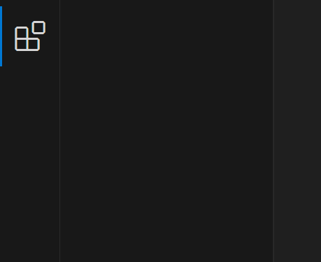
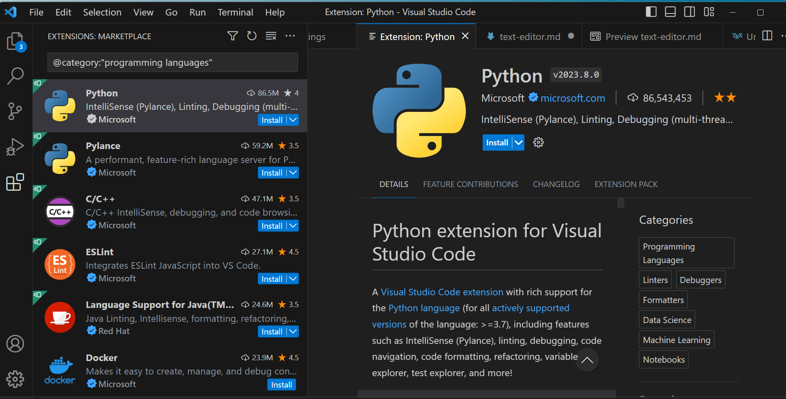

## Installing a text editor

A good text editor lies at the heart of any serious programmer's toolkit: It can do almost anything and makes you much more productive. The editors built into each program often are not the best option (we will find certain cases where you may want to use them).

Please download, install it along with the necessary packages and stick with it for at least for some time to get a feel for how it works.

There is a slight learning curve, but soon you hopefully will be wondering why no-one forced you to do this before!

{}
None of the skills on this website are tied to Visual Studio Code, so if you do decide to move away to another editor, nothing will be lost. 

A nice online text editor for LaTex is [Overleaf](https://www.overleaf.com/). Overleaf provides nice collaboration tools, and it can be used online without any setup needed.
[Vim](https://www.vim.org/) is another widely used text editor.
{}

### Installing Visual Studio Code

#### Windows Users

Go to the [downloads page](https://code.visualstudio.com/download) and download the installer for Windows. Run the installer (VSCodeUserSetup-{version}.exe) and follow the instructions. VS Code is now installed and can be opened from your computer. 
You can open VS Code from your command prompt with just running the one word `code`. 

Additional instructions for the setup on Windows can be found [here](https://code.visualstudio.com/docs/setup/windows). 

#### Mac Users

Go to the [downloads page](https://code.visualstudio.com/download) and download the installer for Mac. Additional instructions for the installation on macOS can be found [here](https://code.visualstudio.com/docs/setup/mac#_alternative-manual-instructions). 

Launching VS code from the command line requires an extra step for Mac users: 
- Open the Command Palette in VS Code with the shortcut `Cmd+Shift+P` to find the command "Shell Command: Install 'code' command in PATH command." Hit enter. 
- You should see a confirming message telling you that "the Shell command `code` is succesfully installed in PATH". 
- Restart the terminal.
- You can open VS Code in your terminal now by typing `$ code.` and hitting enter!

#### Linux/Ubuntu users

Go to the [downloads page](https://code.visualstudio.com/download) and download the right package for the system you are using. Specific instructions for installing VS Code for different Linux distributions can be found [here](https://code.visualstudio.com/docs/setup/linux). 

**Installing Additional Packages for VS Code**

One of the advantages of VS Code is that there are many *extensions* that make your life easier, ranging from simple syntax highlighting to environments that can mimic a complete graphical user interface.

* You can access VS Code's Extensions Marketplace with the shortcut `Ctrl+Shift+X ,` (`CMD+Shift+X` on Mac) on your keyboard or by clicking on this icon on the left side of your screen:

* On this page, you can directly search for Extensions by typing in a name in the search bar. 

* With "@" you can filter your search. Filters such as "@recommended" and "@popular" exist to find popular or recommended extensions. With "@category", you can browse in specific categories. For example, all extensions of programming languages can be found with "@category:"programming languages". 

* When you find the package that you need, you click the blue ‘Install’ button and the package will be installed.
* A list of all your installed extensions can be found by typing "@installed" in the search bar in the Extension Marketplace. 

* You may find the following extensions useful in your day-to-day work in VS Code:
    *   `Python`
    *   `Jupyter`
    *   `R`
    *   `MATLAB`
    *   `LaTex Workshop`
    *   `Markdown All in One`: shortcuts and productivity features for working with Markdown files.
    *   `GitLens`: Enhances the Git integration in VS Code by displaying Git blame annotations and other features.
    *   `Pylance`: A language server extension for Python that provides advanced type checking, autocompletion, and code navigation.
    *   `Prettier`: Code formatter that helps maintain consistent code style across your project.
    *  `Code Runner`: Allows you to run code snippets or entire files in various programming languages from within VS Code.
    * `Visual Studio IntelliCode`: Enhances IntelliSense by providing AI-assisted code completion based on patterns and practices from thousands of open-source projects.
    * `Bracket Pair Colorizer 2`: Helps identify matching brackets with colors, making code more readable.
    * `Live Share`: Collaborative coding extension that enables real-time sharing and editing of code with other developers.
    * `Docker`: Adds support for managing Docker containers and images within VS Code.
    * `SQL Server (mssql)`: Provides SQL Server integration, enabling you to connect to and query databases directly from VS Code.
    * `Excel Viewer`: Allows you to view Excel files within VS Code for quick data analysis.
    * `EditorConfig for VS Code`   
    * `Data Preview`: Allows you to preview data files (CSV, JSON, Excel, etc.) directly within VS Code.
    * `Better Comments`: Improves the readability of comments by colorizing and formatting different types of comments.
    * `Remote - SSH`: Allows you to work with files on a remote machine over SSH, which can be useful for accessing data science environments.
