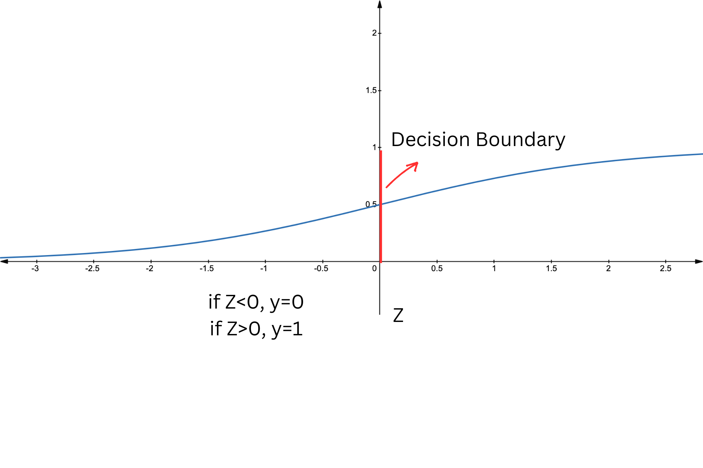

## Overview

The objective of this article is to provide a practical guide to [Support Vector Machines](https://scikit-learn.org/stable/modules/svm.html#svm) (SVM) in Python. SVMs are supervised machine learning models that can handle both linear and non-linear class boundaries by selecting the best line (or plane, if not two-dimensional) that divides the prediction space to maximize the margin between the classes we are trying to classify.

## Large-margin Classifier

In the context of Support Vector Machines (SVM), the **margin** is defined as the distance between the separating hyperplane (decision boundary) and the nearest data points from any class, known as support vectors. The SVM algorithm aims to minimize classification error while maximizing this geometric margin. The support vectors are the closest samples from different classes to the hyperplane, and they are crucial in defining the position and orientation of the hyperplane. By maximizing the margin, the SVM achieves the best possible separation between the classes, leading to better generalization on unseen data. The following images illustrate that, unlike logistic regression which distinguishes two classes with a line, SVM creates a margin between two classes. This characteristic makes SVM a large-margin classifier.

<div style="display: flex; justify-content: center;">
  
  
</div>

In the next figure, the large margin classification approach of SVM is depicted. While both black dashed lines can separate the classes, SVM selects the one that maximizes the margin, as shown by the green lines. Note that this is a case of linearly separable classes.

<p align = "center">

</p>


## Python Application

### Loading Dataset

In this application, we will be using the sklearn Iris dataset. The dataset contains three different target variables corresponding to three different species of iris: *setosa* (0), *versicolor* (1), and *virginica* (2). The goal is to use the sepal length and width of each iris to predict its species.

{} 
```python
# Importing libraries
import numpy as np
import pandas as pd 
import matplotlib.pyplot as plt
from sklearn import datasets
```
{}


{} 
```python
iris = datasets.load_iris()

# Transforming 'iris' from an array to a dataframe
iris_df = pd.DataFrame(iris.data, columns = iris.feature_names)

# Adding a target variable (dependent variable of our model) to the dataframe
iris_df['target'] = iris.target
```
{}


{} 
```python
# Creation of dataset with only sepal features as dependent variables
iris_df = iris_df.drop(['petal length (cm)', 'petal width (cm)'], axis=1)
```
{}

Creating a scatter plot to compare the sepal length and width of different species.

{} 
```python
# Creation of dataframes by species
setosa = iris_df[iris_df['target'] == 0]
versicolor = iris_df[iris_df['target'] == 1]
virginica = iris_df[iris_df['target'] == 2]

# Setting figure size
plt.rcParams['figure.figsize'] = (6, 4)

# Plotting each dataframe
plt.scatter(setosa['sepal length (cm)'], setosa['sepal width (cm)'], color='#003f5c', label='Setosa')
plt.scatter(versicolor['sepal length (cm)'], versicolor['sepal width (cm)'], color='#ffa600', label='Versicolor')
plt.scatter(virginica['sepal length (cm)'], virginica['sepal width (cm)'], color='green', label='Virginica')

# Scatter plot settings
plt.xlabel('Sepal Length (cm)')
plt.ylabel('Sepal Width (cm)')
plt.title('Sepal Length vs Sepal Width (by species)')
plt.legend()

```
{}

<p align = "center">

</p>

From the graph above, it's evident that an iris setosa can be easily distinguished based on its sepal length and width. However, for the other two species, the division boundary appears to be far from linear, indicating the need for further analysis. 

<!-- ### Training and Test Data

The following code snippet splits the dataset into two parts, one containing the input features (X) and the other containing the target variable (y).

{} 
```python
X, y = iris_df.iloc[:, :2], iris_df.target
```
{}

Then, the code further splits X and y into training and testing sets using the *train_test_split* function from the *sklearn.model_selection* module.

{} 
```python
from sklearn.model_selection import train_test_split

X_train, X_test, y_train, y_test = train_test_split(X, y, test_size = 0.2, random_state = 21)
```
{}

-->

### Model Fitting

In this section of the article, we will apply a support vector machine algorithm to the dataset and tune the hyperparameters to identify the combination that yields the highest prediction accuracy.

When classes cannot be linearly separated in the input space, applying SVM enables the projection of data points into a higher-dimensional space where linear separation is possible. In this new space, a separating hyperplane is then created.
The SVM algorithm creates new features using a similarity function known as a `kernel`.

A paramount step in SVM implementation is the selection of a [kernel function](https://scikit-learn.org/stable/modules/svm.html#svm-kernels), which defines the shape (e.g., linear or non-linear) of the decision boundary. 
The most commonly used kernels are the linear, radial basis function (rbf), and polynomial (poly) kernel.
Given the non-linearity of our decision boundary (as seen in the scatter plot above), We will be employing the *rbf* and *poly* kernels and assess which of the two performs better.

Note that using no kernel is equivalent to applying a linear kernel. 

General implementation:

{} 
```python
# Import libraries
from sklearn.model_selection import train_test_split
from sklearn.svm import SVC

# Data preparation
X, y = iris_df.iloc[:, :2], iris_df.target 
X_train, X_test, y_train, y_test = train_test_split(X, y, test_size = 0.2, random_state = 21)

# SVM model
svm_model = SVC(kernel='rbf', C=1, random_state=42) # poly can be used instead of rbf

# Fitting the model
svm_model.fit(X_train, y_train)
```
{}

### Hyperparameters Tuning

In SVM, there are generally three hyperparameters to consider. The first is C, which controls the trade-off between achieving a low training error and a low testing error. The second is the kernel type, which determines the function used to project the data into a higher-dimensional space. The third hyperparameter depends on the chosen kernel. For example, the gamma parameter is used with the RBF kernel, and the degree parameter is used with the polynomial kernel. 

The code above features several self-selected parameters (e.g, kernel, C) that serve as inputs for the model. Tuning these parameters involves substituting different instances of them into the model to evaluate how prediction accuracy varies. The final objective is to select the model with the highest prediction accuracy.

- *C* = penalty parameter for misclassification. A smaller value of C results in higher potential misclassification but in lower potential overfitting. 

In the next figure, a very large C value will perfectly separate the classes in the training data, potentially leading to poor generalization. Conversely, a smaller C value allows for a smoother separation of the classes, promoting better generalization.

<p align = "center">

</p>


- *RBF Kernel*

RBF kernel function is as follow:

<div style="text-align: center;">

K(x, x') = \exp\left(-\gamma \|x - x'\|^2\right)         

</div>

- *gamma($\gamma$)* = influence of a single training example. A smaller gamma implies that points that are further apart are considered similar, hence, the influence of each training example is less localised. Higher values of gamma may lead to overfitting. 

The effect of changing the gamma is depicted in next figure. 

<p align = "center">

</p>

{} 
```python
from sklearn.metrics import accuracy_score

sigma = [0.01, 0.03, 0.1, 0.3, 1, 3, 10, 30]
C = [0.01, 0.03, 0.1, 0.3, 1, 3, 10, 30]

accuracy = list()
sigma_c = list()

for each_s in sigma:
    for each_c in C:
        svm_model = SVC(kernel='rbf', gamma=1/(2*(each_s**2)), C=each_c, random_state=42)
        svm_model.fit(X_train, y_train)
        y_pred = svm_model.predict(X_test)
        accuracy.append(accuracy_score(y_test, y_pred))
        sigma_c.append((each_s, each_c))
```
{}


{} 
```python
# Identifying highest accuracy
index = np.argmax(accuracy)

# Identifying optimal parameters
sigma_opt, c_opt = sigma_c[index]

print(sigma_opt)
print(c_opt)
```
{}


{} 
```python
sigma = sigma_opt
gamma = 1/(2*sigma_opt**2)
C = c_opt

# SVM model with optimal parameters
optimal_svm_rbf = SVC(kernel='rbf', gamma=gamma, C=C, random_state=42)
optimal_svm_rbf.fit(X_train, y_train)

# Training set prediction and accuracy
y_pred_train = optimal_svm_rbf.predict(X_train)
train_accuracy_rbf = accuracy_score(y_train, y_pred_train)

# Test set prediction and accuracy
y_pred_test = optimal_svm_rbf.predict(X_test)
test_accuracy_rbf = accuracy_score(y_test, y_pred_test)

print(train_accuracy_rbf)
print(test_accuracy_rbf)
```
{}

Now, let's try using the polynomial kernel. 

- *Poly Kernel*

In this case, the similarity function used to transform the features is the polynomial function.

<div style="text-align: center;">

K(x, x') = (\alpha \langle x, x' \rangle + c)^d

</div>

As you can see from the polynomial kernel formula, we have the `degree` parameter that can be adjusted. 

- *degree* = degree of the polynomial function used to map the input data in the prediction space. The higher the degree, the greater the flexibility of the model and the potential for overfitting.


{} 
```python
degree = [1, 2, 3, 4, 5]
C = [0.01, 0.03, 0.1, 0.3, 1, 3, 10, 30]

accuracy = list()
d_c = list()

for each_d in degree:
    for each_c in C:
        svm_model = SVC(kernel='poly', degree = each_d, C=each_c, random_state=42)
        svm_model.fit(X_train, y_train)
        y_pred = svm_model.predict(X_test)
        accuracy.append(accuracy_score(y_test, y_pred))
        d_c.append((each_d, each_c))                               
```
{}

{}                                                                                    

Hyperparameters: 

- *C* = penalty parameter for misclassification. A smaller value of C results in higher potential misclassification but in lower potential overfitting. 

- *degree* = degree of the polynomial function used to map the input data in the prediction space. The higher the degree, the greater the flexibility of the model and the potential for overfitting.


{}


{} 
```python
# Identifying highest accuracy
index = np.argmax(accuracy)

# Identifying optimal parameters
d_opt, c_opt = d_c[index]

print(d_opt)
print(c_opt)
```
{}


{} 
```python
degree = d_opt
C = c_opt

# SVM model with optimal parameters
optimal_svm_poly = SVC(kernel='poly', degree=degree, C=C, random_state=42)
optimal_svm_poly.fit(X_train, y_train)

# Training set prediction and accuracy
y_pred_train = optimal_svm_poly.predict(X_train)
train_accuracy_poly = accuracy_score(y_train, y_pred_train)

# Test set prediction and accuracy
y_pred_test = optimal_svm_poly.predict(X_test)
test_accuracy_poly = accuracy_score(y_test, y_pred_test)

print(train_accuracy_poly)
print(test_accuracy_poly)
```
{}


{} 
```python
print(f'RBF Training Accuracy: {train_accuracy_rbf}') #0.87
print(f'POLY Training Accuracy: {train_accuracy_poly}') #0.84
print(f'RBF Test Accuracy: {test_accuracy_rbf}') #0.77
print(f'POLY Test Accuracy: {test_accuracy_poly}') #0.80
```
{}

As a result of employing the two different SVM models, one with the *rbf* kernel and the other with the *poly* kernel, we observe that the former performs slightly better on the training sample, while the latter performs slightly better on the test sample. Given a test set accuracy of 80%, indicating a higher ability to generalise to unseen data, the *poly* kernel (degree = 2 and C = 0.03) is the optimal choice.

The following is a plot of the SVM classifier using the optimal *poly* kernel.

{} 
```python
from matplotlib.colors import ListedColormap

# Settings
x_min, x_max = X.iloc[:, 0].min() - 1, X.iloc[:, 0].max() + 1
y_min, y_max = X.iloc[:, 1].min() - 1, X.iloc[:, 1].max() + 1

xx, yy = np.meshgrid(np.arange(x_min, x_max, 0.02),
                     np.arange(y_min, y_max, 0.02))
Z = optimal_svm_poly.predict(np.c_[xx.ravel(), yy.ravel()])
Z = Z.reshape(xx.shape)

plt.figure(figsize=(6, 4))

# Define colours for each class
setosa_color = '#003f5c'
versicolor_color = '#ffa600'
virginica_color = 'green'

colors = [setosa_color, versicolor_color, virginica_color]
cmap = ListedColormap(colors)

# Plot decision boundary and colour zones using custom colormap
plt.contourf(xx, yy, Z, alpha=0.2, cmap=cmap)

# Scatter plot for each class
setosa = iris_df[iris_df['target'] == 0]
versicolor = iris_df[iris_df['target'] == 1]
virginica = iris_df[iris_df['target'] == 2]

plt.scatter(setosa['sepal length (cm)'], setosa['sepal width (cm)'], color='#003f5c', label='Setosa')
plt.scatter(versicolor['sepal length (cm)'], versicolor['sepal width (cm)'], color='#ffa600', label='Versicolor')
plt.scatter(virginica['sepal length (cm)'], virginica['sepal width (cm)'], color='green', label='Virginica')

# Plot decision boundary lines
plt.contour(xx, yy, Z, colors='k', linewidths=1, alpha=0.5)

# Add labels, title, and legend
plt.xlabel('Sepal Length (cm)')
plt.ylabel('Sepal Width (cm)')
plt.suptitle('Decision boundary of poly kernel')
plt.title('degree = 2, C = 0.03', fontsize=8)
plt.legend()

# Show the plot
plt.show()

```
{}

<p align = "center">

</p>


## Choosing the Right SVM Kernel
The number of new features derived by the similarity function is equal to the number of samples($m$) plus one. Therefore, when solving the SVM and using a kernel as a similarity function, $m+1$ coefficients need to be estimated. As $m$ grows large, the number of coefficients increases dramatically, leading to a significant rise in the complexity of the equation. Consequently, it is crucial to consider the number of sample examples when selecting SVM as the algorithm to train your data.

{}
- If you have a large number of features but a small training set, it might be better to fit a linear decision boundary rather than a complex nonlinear function. This approach reduces the risk of overfitting, which can occur when trying to fit a very complicated function with insufficient data.

- If number of features is small and number of samples is not too big for example is 10000 then Svm with rkb is a good choice. 

- Feature scaling is important when using Gausian kernel.

{}


{}
This article introduces Support Vector Machines in Python by providing:

- a step-by-step practical application to employing the algorithm;
- guide on hyperparameters tuning for selection of the best-performing model.

{}


